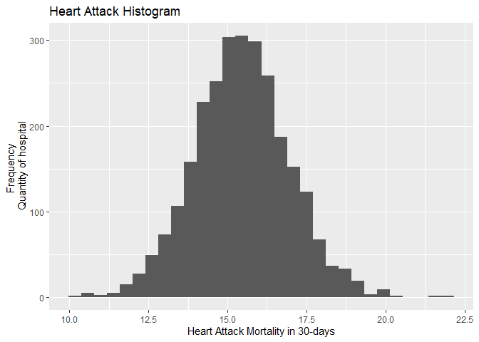

# \[Week 4\]\[R Programming\] Programming Assignment 3: Hospital Quality

#### Tags

-   Specialization: Data Science: Foundations using R Specialization
-   Course: R Programming
    -   Chapter: Week 4
    -   Instructor: Roger D. Peng
    -   URL: <https://www.coursera.org/learn/r-programming>
    -   Rpubs URL: [Programming Assignment 3: Hospital
        Quality](https://rpubs.com/AndersonUyekita/r_programming_hospital_quality)
-   Date: 20/05/2022

------------------------------------------------------------------------

## Sinopsis

This Programming Assignment is part of the R Programming course and
consists of four parts. The dataset analyzed is about the death due to a
specific outcome, such as heart attack, heart failure, or pneumonia.

-   Part 1: Most hospitals in the US have 14 to 17 deaths occasioned by
    heart attacks monthly.
-   Part 2: The
    [`best()`](https://github.com/AndersonUyekita/r_programming-programming_assignment_1/blob/main/Week%204/R/best.R)
    function aims to find the best hospital in any outcomes (heart
    attack, heart failure or pneumonia) in the last 30 days.
-   Part 3: The
    [`rankhospital()`](https://github.com/AndersonUyekita/r_programming-programming_assignment_1/blob/main/Week%204/R/rankhospital.R)
    returns the hospital name of a given state and a given ranking.
-   Part 4: The
    [`rankall()`](https://github.com/AndersonUyekita/r_programming-programming_assignment_1/blob/main/Week%204/R/rankall.R)
    compares several states based on a given ranking.

------------------------------------------------------------------------

## Instructions

### Introduction

Download the file `ProgAssignment3-data.zip` file containing the data
for Programming Assignment 3 from the Coursera web site. Unzip the file
in a directory that will serve as your working directory. When you start
up R make sure to change your working directory to the directory where
you unzipped the data.

``` r
# Data acquisition.

# Creating a folder to host the data from the internet.
base::dir.create(path = "data")

# Downloading the file.
utils::download.file(url = "https://d396qusza40orc.cloudfront.net/rprog%2Fdata%2FProgAssignment3-data.zip",
                     destfile = "./data/ProgAssignment3-data.zip",
                     quiet = TRUE)

# Unzipping the file.
utils::unzip(zipfile = "./data/ProgAssignment3-data.zip", exdir = "./data")

# Printing the CSV file names from the zip file.
base::list.files(path = "./data", pattern = ".csv")
```

    ## [1] "hospital-data.csv"            "outcome-of-care-measures.csv"

The data for this assignment come from the Hospital Compare web site
~~(<http://hospitalcompare.hhs.gov>)~~ run by the U.S. Department of
Health and Human Services. The purpose of the web site is to provide
data and information about the quality of care at over 4,000
Medicare-certified hospitals in the U.S. This dataset essentially covers
all major U.S. hospitals. This dataset is used for a variety of
purposes, including determining whether hospitals should be fined for
not providing high quality care to patients (see
~~<http://goo.gl/jAXFX>~~ for some background on this particular topic).

The Hospital Compare web site contains a lot of data and we will only
look at a small subset for this assignment. The zip file for this
assignment contains three files

-   outcome-of-care-measures.csv: Contains information about 30-day
    mortality and readmission rates for heart attacks, heart failure,
    and pneumonia for over 4,000 hospitals.
-   hospital-data.csv: Contains information about each hospital.
-   Hospital_Revised_Flatfiles.pdf: Descriptions of the variables in
    each file (i.e the code book).

``` r
# Loading hospital-data.csv
data_hosp <- utils::read.csv(file = "./data/hospital-data.csv")

# Loading outcome-of-care-measures.csv
data_outcome <- utils::read.csv(file = "./data/outcome-of-care-measures.csv", 
                                colClasses = "character")
```

A description of the variables in each of the files is in the included
PDF file named `Hospital_Revised_Flatfiles.pdf`. This document contains
information about many other files that are not included with this
programming assignment. You will want to focus on the variables for
Number 19 (`outcome-of-care-measures.csv`) and Number 11
(`hospital-data.csv`). You may find it useful to print out this document
(at least the pages for Tables 19 and 11) to have next to you while you
work on this assignment. In particular, the numbers of the variables for
each table indicate column indices in each table (i.e. “Hospital Name”
is column 2 in the outcome-of-care-measures.csv file).

### Part 1

#### Plot the 30-day mortality rates for heart attack

Read the outcome data into R via the read.csv function and look at the
first few rows.

``` r
# Print the first rows of "outcome-of-care-measures.csv" file.
# I have used DT package to turn it readable.
data_outcome %>% dplyr::as_tibble() %>% head()
```

    ## # A tibble: 6 x 46
    ##   Provider.Number Hospital.Name        Address.1 Address.2 Address.3 City  State
    ##   <chr>           <chr>                <chr>     <chr>     <chr>     <chr> <chr>
    ## 1 010001          SOUTHEAST ALABAMA M~ 1108 ROS~ ""        ""        DOTH~ AL   
    ## 2 010005          MARSHALL MEDICAL CE~ 2505 U S~ ""        ""        BOAZ  AL   
    ## 3 010006          ELIZA COFFEE MEMORI~ 205 MARE~ ""        ""        FLOR~ AL   
    ## 4 010007          MIZELL MEMORIAL HOS~ 702 N MA~ ""        ""        OPP   AL   
    ## 5 010008          CRENSHAW COMMUNITY ~ 101 HOSP~ ""        ""        LUVE~ AL   
    ## 6 010010          MARSHALL MEDICAL CE~ 8000 ALA~ ""        ""        GUNT~ AL   
    ## # ... with 39 more variables: ZIP.Code <chr>, County.Name <chr>,
    ## #   Phone.Number <chr>,
    ## #   Hospital.30.Day.Death..Mortality..Rates.from.Heart.Attack <chr>,
    ## #   Comparison.to.U.S..Rate...Hospital.30.Day.Death..Mortality..Rates.from.Heart.Attack <chr>,
    ## #   Lower.Mortality.Estimate...Hospital.30.Day.Death..Mortality..Rates.from.Heart.Attack <chr>,
    ## #   Upper.Mortality.Estimate...Hospital.30.Day.Death..Mortality..Rates.from.Heart.Attack <chr>,
    ## #   Number.of.Patients...Hospital.30.Day.Death..Mortality..Rates.from.Heart.Attack <chr>, ...

There are many columns in this dataset. You can see how many by typing
ncol(outcome) (you can see the number of rows with the nrow function).
In addition, you can see the names of each column by typing
names(outcome) (the names are also in the PDF document.

To make a simple histogram of the 30-day death rates from heart attack
(column 11 in the outcome dataset), run:

``` r
# Convert character column into numeric one.
# The 11th column is the heart attack mortality in 30 days.
data_outcome[, 11] <- as.numeric(data_outcome[, 11])

## You may get a warning about NAs being introduced; that is okay
# Create a histogram
hist(data_outcome[, 11])
```

<!-- -->

Because we originally read the data in as character (by specifying
colClasses = “character” we need to coerce the column to be numeric. You
may get a warning about NAs being introduced but that is okay.

### Part 2

#### Finding the best hospital in a state

Write a function called best that take two arguments: the 2-character
abbreviated name of a state and an outcome name. The function reads the
outcome-of-care-measures.csv file and returns a character vector with
the name of the hospital that has the best (i.e. lowest) 30-day
mortality for the specified outcome in that state. The hospital name is
the name provided in the Hospital.Name variable. The outcomes can be one
of “heart attack”, “heart failure”, or “pneumonia”. Hospitals that do
not have data on a particular outcome should be excluded from the set of
hospitals when deciding the rankings.

**Handling ties.** If there is a tie for the best hospital for a given
outcome, then the hospital names should be sorted in alphabetical order
and the first hospital in that set should be chosen (i.e. if hospitals
“b”, “c”, and “f” are tied for best, then hospital “b” should be
returned).

The function should use the following template.

    best <- function(state, outcome) {
        ## Read outcome data
        ## Check that state and outcome are valid
        ## Return hospital name in that state with lowest 30-day death
        ## rate
    }

The function should check the validity of its arguments. If an invalid
state value is passed to best, the function should throw an error via
the stop function with the exact message “invalid state”. If an invalid
outcome value is passed to best, the function should throw an error via
the stop function with the exact message “invalid outcome”.

Here is some sample output from the function.

    > source("best.R")
    > best("TX", "heart attack")
    [1] "CYPRESS FAIRBANKS MEDICAL CENTER"
    > best("TX", "heart failure")
    [1] "FORT DUNCAN MEDICAL CENTER"
    > best("MD", "heart attack")
    [1] "JOHNS HOPKINS HOSPITAL, THE"
    > best("MD", "pneumonia")
    [1] "GREATER BALTIMORE MEDICAL CENTER"
    > best("BB", "heart attack")
    Error in best("BB", "heart attack") : invalid state
    > best("NY", "hert attack")
    Error in best("NY", "hert attack") : invalid outcome
    >

Save your code for this function to a file named `best.R`.

#### Solution

``` r
best <- function(state, outcome) {
    
    ## Read outcome data
    data_outcome <- utils::read.csv(file = "./data/outcome-of-care-measures.csv", 
                                    colClasses = "character")
    
    # Create a unique list of STATE in this dataset.
    # IMPORTANT: There are 54 states, which is wrong.
    # However, I found out this dataset contains DC and other territories.
    states_outcome <- base::unique(data_outcome$State)
    
    # List of outcomes
    list_disease <- c("heart attack", "heart failure", "pneumonia")
    
    ## Check that state and outcome are valid
    
    # Valid STATE and Valid OUTCOME
    if ((state %in% states_outcome) & (outcome %in% list_disease)) {
        # Subsetting the raw data.
        data_tidy <- data_outcome %>% select(Hospital.Name, State, starts_with("Hospital.30.Day.Death"))
        
        # Renaming columns to be readable.
        colnames(data_tidy) <- c("hospital_name", "hospital_state","heart_attack", "heart_failure", "pneumonia")
        
        # Uniforming the names with underscore to match during the select.
        outcome_ <- sub(pattern = " ", replacement = "_", x = outcome)
        
        # Converting character into numeric.
        data_tidy$heart_attack <- as.numeric(data_tidy$heart_attack)
        data_tidy$heart_failure <- as.numeric(data_tidy$heart_failure)
        data_tidy$pneumonia <- as.numeric(data_tidy$pneumonia)
                
        data_tidy %>%
            select(hospital_name,hospital_state,all_of(outcome_)) %>%
            filter(hospital_state == state) %>%
            na.omit() %>% select(-hospital_state) %>%
            arrange(across(all_of(outcome_)), hospital_name) %>%
            head(1) %>%
            select(hospital_name) %>%
            as.character() -> message
    }
    
    # Something is wrong with the inputs
    # The state input in not a valid one
    if (!(state %in% states_outcome) & (outcome %in% list_disease)) {
        return(base::cat(base::sprintf('Error in best("%s", "%s") : invalid state', state, outcome)))
    }
        
    # The outcome in not valid.
    if ((state %in% states_outcome) & !(outcome %in% list_disease)) {
        return(base::cat(base::sprintf('Error in best("%s", "%s") : invalid outcome', state, outcome)))
    }
        
    # Both state and outcome has typos
    if (!(state %in% states_outcome) & !(outcome %in% list_disease)) {
        return(base::cat(base::sprintf('Error in best("%s", "%s") : invalid state and outcome', state, outcome)))
    }
    
    ## Return hospital name in that state with lowest 30-day death
    
    ## rate
    return(message)
}
```

#### Testing best function

``` r
best("TX", "heart attack")
```

    ## [1] "CYPRESS FAIRBANKS MEDICAL CENTER"

``` r
best("TX", "heart failure")
```

    ## [1] "FORT DUNCAN MEDICAL CENTER"

``` r
best("MD", "heart attack")
```

    ## [1] "JOHNS HOPKINS HOSPITAL, THE"

``` r
best("MD", "pneumonia")
```

    ## [1] "GREATER BALTIMORE MEDICAL CENTER"

``` r
best("BB", "heart attack")
```

    ## Error in best("BB", "heart attack") : invalid state

``` r
best("NY", "hert attack")
```

    ## Error in best("NY", "hert attack") : invalid outcome

### Part 3

#### Ranking hospitals by outcome in a state

Write a function called `rankhospital` that takes three arguments: the
2-character abbreviated name of a state (`state`), an outcome
(`outcome`), and the ranking of a hospital in that state for that
outcome (num). The function reads the `outcome-of-care-measures.csv`
file and returns a character vector with the name of the hospital that
has the ranking specified by the num argument. For example, the call:

    rankhospital("MD", "heart failure", 5)

would return a character vector containing the name of the hospital with
the 5th lowest 30-day death rate for heart failure. The `num` argument
can take values “best”, “worst”, or an integer indicating the ranking
(smaller numbers are better). If the number given by `num` is larger
than the number of hospitals in that state, then the function should
return `NA`. Hospitals that do not have data on a particular outcome
should be excluded from the set of hospitals when deciding the rankings.

**Handling ties.** It may occur that multiple hospitals have the same
30-day mortality rate for a given cause of death. In those cases ties
should be broken by using the hospital name. For example, in Texas
(“TX”), the hospitals with lowest 30-day mortality rate for heart
failure are shown here.

    > head(texas)
    Hospital.Name Rate Rank
    3935 FORT DUNCAN MEDICAL CENTER 8.1 1
    4085 TOMBALL REGIONAL MEDICAL CENTER 8.5 2
    4103 CYPRESS FAIRBANKS MEDICAL CENTER 8.7 3
    3954 DETAR HOSPITAL NAVARRO 8.7 4
    4010 METHODIST HOSPITAL,THE 8.8 5
    3962 MISSION REGIONAL MEDICAL CENTER 8.8 6

Note that **Cypress Fairbanks Medical Center** and **Detar Hospital
Navarro** both have the same 30-day rate (8.7). However, because Cypress
comes before Detar alphabetically, Cypress is ranked number 3 in this
scheme and Detar is ranked number 4. One can use the `order` function to
sort multiple vectors in this manner (i.e. where one vector is used to
break ties in another vector).

The function should use the following template

    rankhospital <- function(state, outcome, num = "best") {
        ## Read outcome data
        ## Check that state and outcome are valid
        ## Return hospital name in that state with the given rank
        ## 30-day death rate
    }

The function should check the validity of its arguments. If an invalid
state value is passed to rankhospital, the function should throw an
error via the stop function with the exact message “invalid state”. If
an invalid outcome value is passed to rankhospital, the function should
throw an error via the stop function with the exact message “invalid
outcome”.

Here is some sample output from the function.

    > source("rankhospital.R")
    > rankhospital("TX", "heart failure", 4)
    [1] "DETAR HOSPITAL NAVARRO"
    > rankhospital("MD", "heart attack", "worst")
    3
    [1] "HARFORD MEMORIAL HOSPITAL"
    > rankhospital("MN", "heart attack", 5000)
    [1] NA

Save your code for this function to a file named `rankhospital.R`.

#### Solution

``` r
rankhospital <- function(state, outcome, num = "best") {
    
    ## Read outcome data
    data_outcome <- utils::read.csv(file = "./data/outcome-of-care-measures.csv",
                                    colClasses = "character")
    
    # Adding the row number
    data_outcome <- data_outcome %>% add_rownames()
    
    # Create a unique list of STATE
    states_outcome <- base::unique(data_outcome$State)
    
    # List of outcomes
    list_disease <- c("heart attack", "heart failure", "pneumonia")
    
    ## Check that state and outcome are valid
    
    # Valid STATE and Valid OUTCOME
    if ((state %in% states_outcome) & (outcome %in% list_disease)) {
        
        # Subsetting the raw data.
        # I want the death data of the last 30 Day all and other columns I will ignore.
        data_tidy <- data_outcome %>%
            select(rowname, Hospital.Name,
                   State,
                   starts_with("Hospital.30.Day.Death"))
        
        # Renaming columns to be more readable.
        colnames(data_tidy) <- c("rowname",
                                 "hospital_name",
                                 "hospital_state",
                                 "heart_attack",
                                 "heart_failure",
                                 "pneumonia")
        
        # Uniforming the colnames with underscore to match during the select.
        outcome_ <- sub(pattern = " ",
                        replacement = "_",
                        x = outcome)
        
        # Converting character into numeric.
        # The read.csv has forced all columns to be character (colClasses = "character")
        data_tidy$heart_attack <- as.numeric(data_tidy$heart_attack)
        data_tidy$heart_failure <- as.numeric(data_tidy$heart_failure)
        data_tidy$pneumonia <- as.numeric(data_tidy$pneumonia)
        
        # Subsetting the input outcome given from the operator. 
        data_rank <- data_tidy %>%
            select(rowname,                # 
                   hospital_name,          # Selecting: Hospital name, Hospital State
                   hospital_state,         #            and outcome
                   all_of(outcome_)) %>%   # 
            
            filter(hospital_state == state) %>%  # Filtering the data based on state given by operator.
            
            na.omit() %>%                        # Filtering only rows with data
            
            arrange(across(all_of(outcome_)),    # Arranging first by the outcome, then by hospital name
                    hospital_name) %>%           #
            
            mutate(Rank = 1:nrow(.))             # Add a column with the ranking of each hospital.

        
    # The num input has two conditions:
    # 1. numeric
    # 2. character
        
    # Checking if the num input is character:
    if (is.character(num)) {
        
        # However, there are 2 conditions in this case of character:
        # 1. best -> I need to show the best hospital
        # 2. worst -> I need to show the worst hospital
        
        # IN CASE: the num variable is the character's worst.
        if (num == "worst") {
            
            # TAIL will give the worst hospital in that outcome.
            data_rank %>%
                select(-hospital_state) %>%
                rename(" " = rowname,
                       "Hospital.Name" = hospital_name,
                       "Rate" = all_of(outcome_),
                       "Rank" = Rank) %>%
                tail(1) %>%
                select(Hospital.Name) %>%
                as.character() -> output
            
            # Return the hospital with the worst outcome.
            return(output)
        }
        
        # IN CASE: the num variable is the character's best.
        else if (num == "best") {
            # HEAD will select the best hospital in that outcome.
            data_rank %>%
                select(-hospital_state) %>%
                rename(" " = rowname,
                       "Hospital.Name" = hospital_name,
                       "Rate" = all_of(outcome_),
                       "Rank" = Rank) %>%
                head(Rank == num) %>%
                select(Hospital.Name) %>%
                as.character() -> output
            
            # Return the hospital with the best outcome.
            return(output)
        }
        
        # The script only accepts characters: best and worst.
        # Any other characters will throw an error.
        else {
            return(cat("Please, check the num input."))
        }
    }
        
    # Checking if the num input is a numeric variable and the num input and if it is a single number.
    # should be a single value (not a vector).
    if (is.numeric(num) & length(num) == 1) {
        
        # We have also two conditions here:
        # 1. If the num input is out of the boundaries
        # 2. A single number between 1 and the number of hospital.
        
        # IN CASE the num input is between 1 the number of rows of the dataset.
        if (num >= 1 & num < nrow(data_rank)) {
            
            # Filter will select the exactly num rank.
            data_rank %>%
                select(-hospital_state) %>%
                rename(" " = rowname,
                       "Hospital.Name" = hospital_name,
                       "Rate" = all_of(outcome_),
                       "Rank" = Rank) %>%
                filter(Rank == num) %>%
                select(Hospital.Name) %>%
                as.character() -> output
            
            # Return the hospital in the "num position" in that outcome.
            return(output)
        }
        
        # The num input is wrong because is negative, zero or above the number of hospital.
        else {
            # Following the instructions. For num above of the number of hospital return NA.
            return(NA)
        }
    }
    
    # Warning the operator about a problem in num input.
    else if (length(num) >= 2) {
        return(print("Please, make sure your num input is a single value."))
    }

    }
    
    # Something is wrong with the inputs
    # The state input in not a valid one
    else if (!(state %in% states_outcome) & (outcome %in% list_disease)) {
        return(base::cat(base::sprintf('Error in best("%s", "%s") : invalid state', state, outcome)))
    }
        
    # The outcome in not valid.
    else if ((state %in% states_outcome) & !(outcome %in% list_disease)) {
        return(base::cat(base::sprintf('Error in best("%s", "%s") : invalid outcome', state, outcome)))
    }
        
    # Both state and outcome has typos
    else if (!(state %in% states_outcome) & !(outcome %in% list_disease)) {
        return(base::cat(base::sprintf('Error in best("%s", "%s") : invalid state and outcome', state, outcome)))
    }
}
```

#### Testing rankhospital function

``` r
rankhospital("TX", "heart failure", 4)
```

    ## [1] "DETAR HOSPITAL NAVARRO"

``` r
rankhospital("MD", "heart attack", "worst")
```

    ## [1] "HARFORD MEMORIAL HOSPITAL"

``` r
rankhospital("MN", "heart attack", 5000)
```

    ## [1] NA

### Part 4

#### Ranking hospitals in all states

Write a function called `rankall` that takes two arguments: an outcome
name (`outcome`) and a hospital ranking (`num`). The function reads the
`outcome-of-care-measures.csv` file and returns a 2-column data frame
containing the hospital in each state that has the ranking specified in
`num.` For example the function call `rankall`(“heart attack”, “best”)
would return a data frame containing the names of the hospitals that are
the best in their respective states for 30-day heart attack death rates.
The function should return a value for every state (some may be NA). The
first column in the data frame is named **hospital**, which contains the
hospital name, and the second column is named **state**, which contains
the 2-character abbreviation for the state name. Hospitals that do not
have data on a particular outcome should be excluded from the set of
hospitals when deciding the rankings.

**Handling ties.** The `rankall` function should handle ties in the
30-day mortality rates in the same way that the `rankhospital` function
handles ties.

The function should use the following template.

    rankall <- function(outcome, num = "best") {
        ## Read outcome data
        ## Check that state and outcome are valid
        ## For each state, find the hospital of the given rank
        ## Return a data frame with the hospital names and the
        ## (abbreviated) state name
    }

**NOTE:** For the purpose of this part of the assignment (and for
efficiency), your function should NOT call the `rankhospital` function
from the previous section.

The function should check the validity of its arguments. If an invalid
`outcome` value is passed to `rankall`, the function should throw an
error via the **stop function** with the exact message “invalid
outcome”. The num variable can take values “best”, “worst”, or an
integer indicating the ranking (smaller numbers are better). If the
number given by `num` is larger than the number of hospitals in that
state, then the function should return `NA`.

Here is some sample output from the function.

    > source("rankall.R")
    > head(rankall("heart attack", 20), 10)

                                    hospital  state
    AK                                  <NA>     AK
    AL        D W MCMILLAN MEMORIAL HOSPITAL     AL
    AR     ARKANSAS METHODIST MEDICAL CENTER     AR
    AZ   JOHN C LINCOLN DEER VALLEY HOSPITAL     AZ
    CA                 SHERMAN OAKS HOSPITAL     CA
    CO              SKY RIDGE MEDICAL CENTER     CO
    CT               MIDSTATE MEDICAL CENTER     CT
    DC                                  <NA>     DC
    DE                                  <NA>     DE
    FL        SOUTH FLORIDA BAPTIST HOSPITAL     FL

    > tail(rankall("pneumonia", "worst"), 3)

                                         hospital   state
    WI MAYO CLINIC HEALTH SYSTEM - NORTHLAND, INC      WI
    WV                     PLATEAU MEDICAL CENTER      WV
    WY           NORTH BIG HORN HOSPITAL DISTRICT      WY

    > tail(rankall("heart failure"), 10)

                                                                hospital   state
    TN                         WELLMONT HAWKINS COUNTY MEMORIAL HOSPITAL      TN
    TX                                        FORT DUNCAN MEDICAL CENTER      TX
    UT VA SALT LAKE CITY HEALTHCARE - GEORGE E. WAHLEN VA MEDICAL CENTER      UT
    VA                                          SENTARA POTOMAC HOSPITAL      VA
    VI                            GOV JUAN F LUIS HOSPITAL & MEDICAL CTR      VI
    VT                                              SPRINGFIELD HOSPITAL      VT
    WA                                         HARBORVIEW MEDICAL CENTER      WA
    WI                                    AURORA ST LUKES MEDICAL CENTER      WI
    WV                                         FAIRMONT GENERAL HOSPITAL      WV
    WY                                        CHEYENNE VA MEDICAL CENTER      WY

#### Solution

``` r
rankall <- function(outcome, num = "best") {
    
    ## Read outcome data
    data_outcome <- utils::read.csv(file = "./data/outcome-of-care-measures.csv",
                                    colClasses = "character")
    
    # Adding the row number
    data_outcome <- data_outcome %>% add_rownames()
    
    # Create a unique list of STATE
    states_outcome <- base::unique(data_outcome$State)
    
    # List of outcomes
    list_disease <- c("heart attack", "heart failure", "pneumonia")
    
    # Subsetting the raw data.
    # I want the death data of the last 30 Day all and other columns I will ignore.
    data_tidy <- data_outcome %>%
        select(rowname, Hospital.Name,
               State,
               starts_with("Hospital.30.Day.Death"))
    
    # Renaming columns to be more readable.
    colnames(data_tidy) <- c("rowname",
                             "hospital_name",
                             "hospital_state",
                             "heart_attack",
                             "heart_failure",
                             "pneumonia")
        
    # Uniforming the colnames with underscore to match during the select.
    outcome_ <- sub(pattern = " ",
                    replacement = "_",
                    x = outcome)
        
    # Converting character into numeric.
    # The read.csv has forced all columns to be character (colClasses = "character")
    data_tidy$heart_attack <- as.numeric(data_tidy$heart_attack)
    data_tidy$heart_failure <- as.numeric(data_tidy$heart_failure)
    data_tidy$pneumonia <- as.numeric(data_tidy$pneumonia)
    
    # Checking if the operator has inserted a valid outcome.
    if (outcome %in% list_disease) {
        
        # Creating a group and ranking by state. 
        data_rank_state <- data_tidy %>%
            group_by(hospital_state) %>%
            mutate(ranking = order(order(across(all_of(outcome_)), hospital_name))) 

        # The num input has two conditions:
        # 1. numeric
        # 2. character
        
        # Checking if the num input is character:
        if (is.character(num)) {
            
            # However, there are 2 conditions in this case of character:
            # 1. best -> I need to show the best hospital
            # 2. worst -> I need to show the worst hospital
            
            # IN CASE: the num variable is the character's worst.
            if (num == "worst") {
                
                # MAX will give the worst hospital in that outcome.
                data_rank_state %>%
                    filter(!is.na(across(all_of(outcome_)))) %>%
                    filter(ranking == max(ranking, na.rm = TRUE)) %>%
                    select(hospital_name,hospital_state) %>%
                    arrange(hospital_state, all_of(hospital_name)) -> output

                # Return the hospital with the worst outcome.
                return(output)
            }
        
            # IN CASE: the num variable is the character's best.
            else if (num == "best") {

                # MIN will select the best hospital in that outcome.
                data_rank_state %>%
                    filter(ranking == min(ranking, na.rm = TRUE)) %>%
                    select(hospital_name,hospital_state) %>%
                    arrange(hospital_state, all_of(hospital_name)) -> output
    
                # Return the hospital with the best outcome.
                return(output)
            }
        
            # The script only accepts characters: best and worst.
            # Any other characters will throw an error.
            else {
                return(cat("Please, check the num input."))
            }
        }
        
        # Checking if the num input is a numeric variable and the num input and if it is a single number.
        # should be a single value (not a vector).
        if (is.numeric(num) & length(num) == 1) {
        
            # We have also two conditions here:
            # 1. If the num input is out of the boundaries
            # 2. A single number between 1 and the number of hospital.
        
            # IN CASE the num input is between 1 the number of rows of the dataset.
            if (num >= 1 & num < nrow(data_rank_state)) {
                
                # Filter will select the exactly num rank.
                data_rank_state %>%
                    filter(ranking == num) %>%
                    select(hospital_name,hospital_state) %>%
                    arrange(hospital_state, all_of(hospital_name)) -> output

                # Creating the rows of state with NA.
                merge(x = data_tidy %>% select(hospital_state) %>% unique() %>% arrange(hospital_state),
                      y = output,
                      all = TRUE) -> output
                
                # Return the hospital in the "num position" in that outcome.
                return(output)
            }
        
            # The num input is wrong because is negative, zero or above the number of hospital.
            else {
                # Following the instructions. For num above of the number of hospital return NA.
                return(NA)
            }
        }
    
        # Warning the operator about a problem in num input.
        else if (length(num) >= 2) {
            return(print("Please, make sure your num input is a single value."))
        }
    }
    
    # Something is wrong with the inputs
    
    # The outcome in not valid.
    else if (!(outcome %in% list_disease)) {
        return(base::cat(base::sprintf('Error in rankhospital(outcome = "%s", num = "%s") : invalid outcome', state, num)))
    }
}
```

#### Testing rankall function

``` r
head(rankall("heart attack", 20), 10)
```

    ##    hospital_state                       hospital_name
    ## 1              AK                                <NA>
    ## 2              AL      D W MCMILLAN MEMORIAL HOSPITAL
    ## 3              AR   ARKANSAS METHODIST MEDICAL CENTER
    ## 4              AZ JOHN C LINCOLN DEER VALLEY HOSPITAL
    ## 5              CA               SHERMAN OAKS HOSPITAL
    ## 6              CO            SKY RIDGE MEDICAL CENTER
    ## 7              CT             MIDSTATE MEDICAL CENTER
    ## 8              DC                                <NA>
    ## 9              DE                                <NA>
    ## 10             FL      SOUTH FLORIDA BAPTIST HOSPITAL

``` r
tail(rankall("pneumonia", "worst"), 3)
```

    ## # A tibble: 3 x 2
    ## # Groups:   hospital_state [3]
    ##   hospital_name                              hospital_state
    ##   <chr>                                      <chr>         
    ## 1 MAYO CLINIC HEALTH SYSTEM - NORTHLAND, INC WI            
    ## 2 PLATEAU MEDICAL CENTER                     WV            
    ## 3 NORTH BIG HORN HOSPITAL DISTRICT           WY

``` r
tail(rankall("heart failure"), 10)
```

    ## # A tibble: 10 x 2
    ## # Groups:   hospital_state [10]
    ##    hospital_name                                                  hospital_state
    ##    <chr>                                                          <chr>         
    ##  1 WELLMONT HAWKINS COUNTY MEMORIAL HOSPITAL                      TN            
    ##  2 FORT DUNCAN MEDICAL CENTER                                     TX            
    ##  3 VA SALT LAKE CITY HEALTHCARE - GEORGE E. WAHLEN VA MEDICAL CE~ UT            
    ##  4 SENTARA POTOMAC HOSPITAL                                       VA            
    ##  5 GOV JUAN F LUIS HOSPITAL & MEDICAL CTR                         VI            
    ##  6 SPRINGFIELD HOSPITAL                                           VT            
    ##  7 HARBORVIEW MEDICAL CENTER                                      WA            
    ##  8 AURORA ST LUKES MEDICAL CENTER                                 WI            
    ##  9 FAIRMONT GENERAL HOSPITAL                                      WV            
    ## 10 CHEYENNE VA MEDICAL CENTER                                     WY
